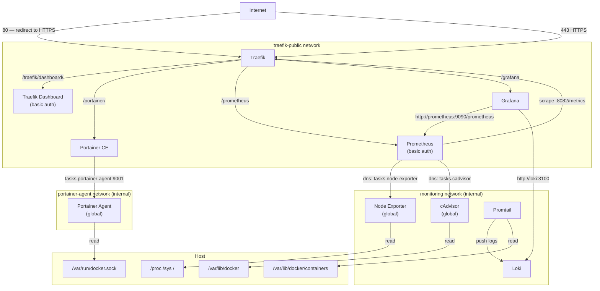

# Docker Swarm Orchestration

Single-node Docker Swarm with Traefik v3 as reverse proxy, Portainer for management, Prometheus + Grafana for metrics, and Loki + Promtail for logging.

## Architecture



| Service | URL | Notes |
|---|---|---|
| **Traefik v3** | https://lut.longle77.site/traefik/dashboard/ | Reverse proxy + dashboard (basic auth) |
| **Portainer CE** | https://lut.longle77.site/portainer/ | Container/swarm management UI |
| **Prometheus** | https://lut.longle77.site/prometheus | Metrics scraping (basic auth) |
| **Grafana** | https://lut.longle77.site/grafana | Dashboards & visualisation |
| **Loki** | internal only | Log aggregation (Grafana datasource) |

---

## Directory Structure

```
devops/
├── stacks/
│   ├── traefik.yml          # Traefik v3: reverse proxy + Let's Encrypt + metrics
│   ├── portainer.yml        # Portainer CE + Agent
│   ├── monitoring.yml       # Prometheus + Grafana + Node Exporter + cAdvisor
│   └── loki.yml             # Loki + Promtail
├── configs/
│   ├── prometheus/
│   │   └── prometheus.yml   # Prometheus scrape configuration
│   ├── loki/
│   │   └── loki-config.yml  # Loki storage + retention config
│   ├── promtail/
│   │   └── promtail-config.yml  # Promtail Docker log collector
│   └── grafana/
│       └── provisioning/
│           ├── datasources/
│           │   └── prometheus.yml   # Prometheus + Loki datasources
│           └── dashboards/
│               ├── dashboard.yml            # Dashboard loader config
│               └── (dashboard JSONs)        # Provisioned at deploy time
```

---

## Grafana Dashboards

The following dashboards are automatically provisioned on deploy:

| Dashboard | Source |
|---|---|
| Node Exporter Full | Host CPU, memory, disk, network |
| cAdvisor | Per-container resource usage |
| Traefik | Request rates, latencies, error codes |
| Docker Container Logs | Loki log browser by stack/service |

To update a dashboard, replace the JSON file in `configs/grafana/dashboards/` and bump the config version in `stacks/monitoring.yml` (e.g. `grafana-dash-traefik-v2`).

---

## Logging (Loki)

Promtail runs in **global mode** (one instance per swarm node) and automatically collects logs from all swarm services via Docker service discovery — no configuration needed when adding new services.

Logs are labelled with: `stack`, `service`, `container`, `stream`.

Query logs in **Grafana → Explore → Loki**:
```
{stack="monitoring"}
{service="traefik_traefik"}
{service="mystack_myapp"} |= "error"
```

---

## Adding New Services

To expose a new service through Traefik, add it to the `traefik-public` network and set deploy labels:

```yaml
networks:
  - traefik-public

deploy:
  labels:
    - traefik.enable=true
    - traefik.docker.network=traefik-public
    - traefik.http.routers.myapp.rule=Host(`lut.longle77.site`) && PathPrefix(`/myapp`)
    - traefik.http.routers.myapp.entrypoints=websecure
    - traefik.http.routers.myapp.tls=true
    - traefik.http.routers.myapp.tls.certresolver=letsencrypt
    - traefik.http.routers.myapp.middlewares=myapp-strip
    - traefik.http.middlewares.myapp-strip.stripprefix.prefixes=/myapp
    - traefik.http.services.myapp.loadbalancer.server.port=<container-port>
```

For internal services (databases, caches) that don't need public routing, use a private overlay network and do **not** attach them to `traefik-public`.

---

## Useful Commands

```bash
# View running stacks
docker stack ls

# View services in a stack
docker stack services traefik
docker stack services portainer
docker stack services monitoring
docker stack services loki

# View service logs
docker service logs -f traefik_traefik
docker service logs -f monitoring_prometheus
docker service logs -f monitoring_grafana
docker service logs -f loki_loki
docker service logs -f loki_promtail

# Restart a service
docker service update --force monitoring_grafana

# Redeploy a single stack after config changes
docker stack deploy -c /home/sudo_user/swarm/stacks/traefik.yml --with-registry-auth traefik
docker stack deploy -c /home/sudo_user/swarm/stacks/monitoring.yml --with-registry-auth monitoring
docker stack deploy -c /home/sudo_user/swarm/stacks/loki.yml --with-registry-auth loki
```

---

## Updating Docker Configs (Grafana/Prometheus/Loki)

Docker Swarm configs are immutable. To update any config file:
1. Edit the file in `configs/`
2. Bump the version suffix in `stacks/monitoring.yml` or `stacks/loki.yml` (e.g. `v1` → `v2`)
3. Redeploy the stack

---

## Security Notes

- The `traefik-public` network is the public routing bus — only attach services that need HTTPS exposure.
- The `monitoring` network is internal — Prometheus, Grafana, Loki, and Promtail communicate here, isolated from public traffic.
- `portainer_admin_password` and `grafana_admin_password` are similar to the server's password for sudo_user
- Traefik reads `/var/run/docker.sock` in read-only mode.
- Promtail reads `/var/lib/docker/containers` in read-only mode.
- Portainer and Grafana have their own auth systems.
